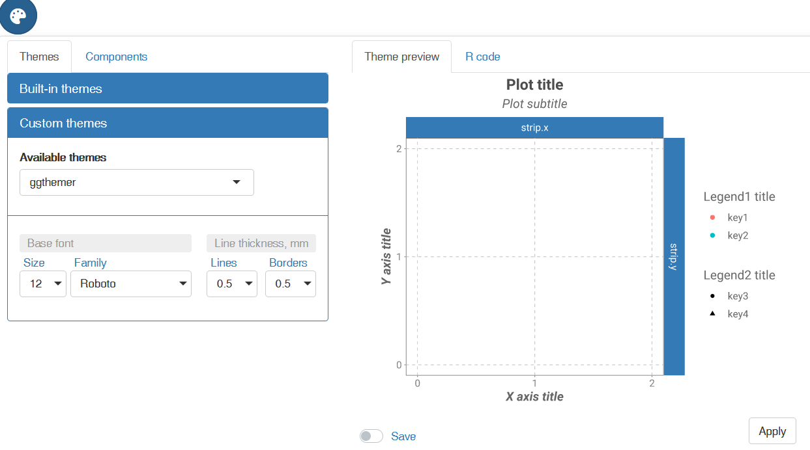

### Description

*ggthemer* is a Shiny module that adds graphical user interface (GUI) to
control many theme elements of the *ggplot2*-generated plots.

### Installation

    if (!require("devtools", quietly = T)) {
      install.packages("devtools")
    }
    devtools::install_github("DzmitryGB/ggthemer")

### Usage

*ggthemer* can be used directly via a wrapper function, `ggthemerGUI`,
that runs a in-built Shiny app. There are several ways the function can
be used. If no arguments is passed (e.g. `ggthemerGUI()`), the only
element displayed on the page is the theme button. Close the browser
window to quit. If ‘Apply’ button was pressed, the function will return
theme component only.

    my_theme <- ggthemerGUI() # don't forget to hit Apply
    my_plot <- my_plot + ggthemerGUI()

Alternatively, passing a ggplot2 object to the function will also put
the plot into the browser, so the applied changes can be seen
immediately. Close the browser window to quit. The function will then
return plot with the custom theme applied.

    my_plot <- ggthemerGUI(my_plot)

Another way is to simply copy the code from the ‘R code’ tab and paste
into your scripts.

To use *ggthemer* inside your own Shiny apps, two functions are
provided, `ggthemerUI` and `ggthemerSERV`. Please refer to the
documentation and the example app (found via
`system.file("ggthemerApp", package = "ggthemer")`).

### Extra fonts

*ggthemer* uses
[showtext](https://cran.rstudio.com/web/packages/showtext/vignettes/introduction.html)
package as a way to add extra fonts to the *ggplot2* plots. The direct
implementation is by passing a list object of locally available fonts as
a parameter to the `ggthemerUI` function. The latter, in turn, uses
`sysfonts::font_add` function to make the fonts available.

    cached_fonts <- list(
        Roboto = list(
            family = "Roboto",
            regular = "fonts/Roboto-Regular.ttf",
            bold = "fonts/Roboto-Bold.ttf",
            italic = "fonts/Roboto-Italic.ttf",
            bolditalic = "fonts/Roboto-BoldItalic.ttf"
        )
    )
    ggthemerUI('myID', cached_fonts)

### Persistence

Saved themes are automatically saved to a local user folder (determined
by `tools::R_user_dir("ggthemer")`) so that they should be available
during different sessions.

### Screenshots

 
